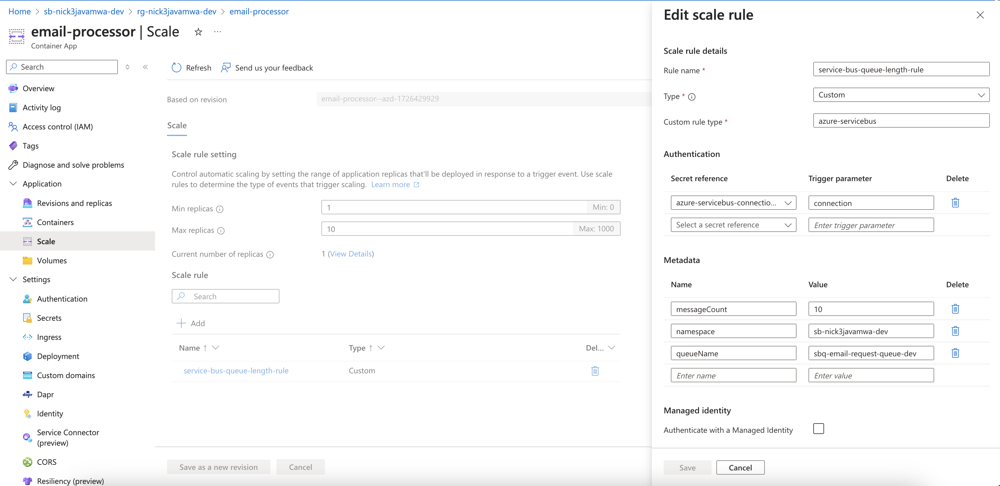
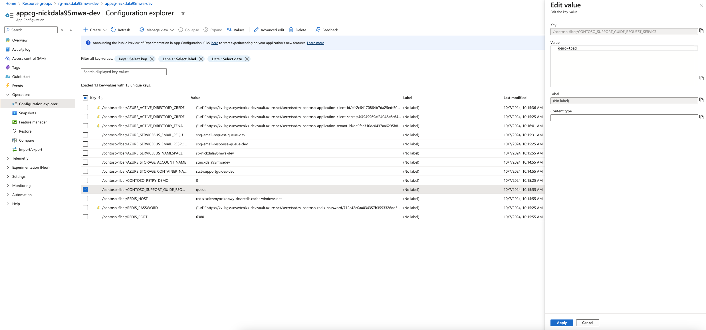
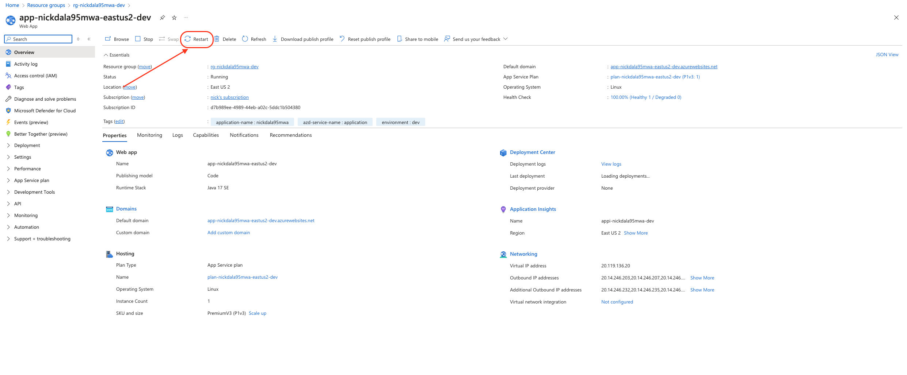
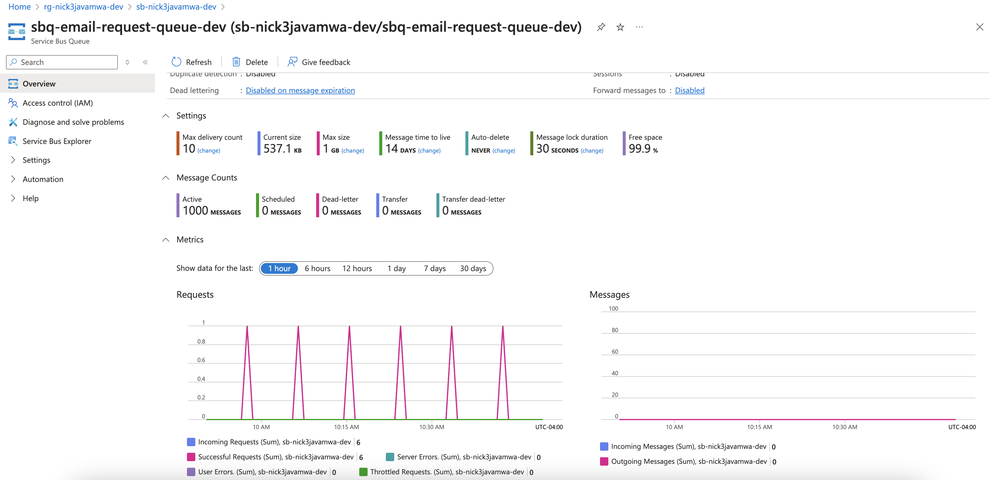
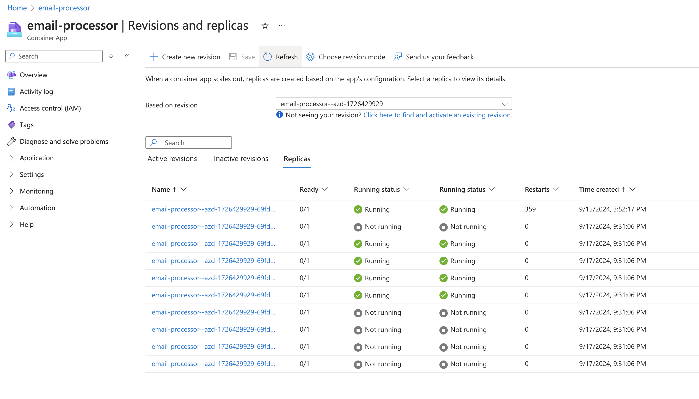

# Queue-Based Load Leveling with Java and Azure Service Bus

**Today, we’re exploring the **Queue-Based Load Leveling** pattern—a powerful method for smoothing out workload spikes—using Java and Azure Service Bus. For a detailed look into the architecture, components, and workflow of the email processor app, check out the [demo.md](demo.md) file.**


## Why Choose Queue-Based Load Leveling?

In today's fast-paced software environment, dynamic workloads are common. The **Queue-Based Load Leveling pattern** decouples the production and consumption of tasks by introducing a queue between them. This allows producers and consumers to work independently, preventing system overload during traffic spikes.

For small, monolithic applications, in-memory queues might suffice. However, as applications scale or adopt distributed architectures, these simple queues can become bottlenecks. In a distributed setting, relying on in-memory queues means the entire message load is handled by a single node's memory, which can quickly become a congestion point under heavy traffic. This setup lacks scalability, fault tolerance, and load balancing, making it difficult to efficiently manage surges in workload without increased latency or potential message loss.

This is where **Azure Service Bus** comes into play. As a robust, cloud-native messaging solution, it provides the scalability, durability, and resilience that modern applications demand.

---

## Overview of the Sample Application

We'll demonstrate a sample application that implements the Queue-Based Load Leveling pattern in Java. Here's what it entails:

- **Email Simulation:**  
  Multiple producers generate email tasks—each with a unique ID—and enqueue them into a shared `BlockingQueue`. Consumers process these tasks asynchronously. A “poison pill” mechanism ensures that consumer threads terminate gracefully when their work is done.

- **Real-Time Status Dashboard:**  
  A Swing-based UI updates every 500 milliseconds, displaying live metrics such as current queue length, total emails produced, processed counts, and the number of active threads.

- **LLM-Generated Performance Report:**  
  At the end of the simulation, the application gathers performance metrics and crafts a prompt for LangChain4j. Using Ollama with the phi4 model, it then streams a natural language report summarizing overall performance.

- **Modern Concurrency with Java 21:**  
  Leveraging Java 21’s virtual threads, the application handles concurrency efficiently, reducing traditional overhead and making the code both cleaner and faster.

---

## Getting Started

### Prerequisites

Before diving in, ensure you have:

- **Java 21:**  
  Leverage the latest Java features, including virtual threads.

- **Maven:**  
  Manage dependencies and build the project seamlessly.

- **Ollama:**  
  Install [Ollama](https://ollama.com/) and set up the phi4 model:
  ```bash
  ollama pull phi4
  ollama run phi4
  ```
  Ensure the LLM server is accessible at `http://localhost:11434`.

### Installation Steps

1. **Clone the Repository:**
   ```bash
   git clone https://github.com/roryp/blog
   cd blog
   ```

2. **Build the Project:**
   ```bash
   mvn clean package
   ```
   This compiles your source code and produces an executable JAR in the `target` directory.

### Running the Application

1. **Start the LLM Service:**  
   Ensure Ollama is running:
   ```bash
   ollama pull phi4
   ollama run phi4
   ```

2. **Launch the Application:**  
   Start the application with:
   ```bash
   java -jar target/your-app.jar
   ```
   A simple UI will appear with live metrics, and after a brief simulation, an LLM-generated performance report will be displayed in your console.

> **NOTE:** For a more detailed look into the architecture, components, and workflow of the email processor app, check out the [demo.md](demo.md) file.

---

## Advancing to Azure Service Bus

While in-memory queues are suitable for prototyping, enterprise-grade applications require a messaging backbone that can handle heavy loads. **Azure Service Bus** offers:

- **Decoupling:**  
  Offload message processing to keep your main application responsive.

- **Scalability:**  
  Automatically adjust to workload changes without overprovisioning.

- **Resilience:**  
  Features like message persistence, automatic retries, and dead-letter queues ensure your system can handle failures gracefully.

Azure Service Bus allows you to focus on your core business logic instead of managing low-level messaging operations. Instead of processing emails synchronously and risking performance bottlenecks during high-traffic periods, this design offloads email handling to a dedicated service. Deployed via **Azure Container Apps**, the service continuously monitors the queue and processes messages asynchronously, ensuring reliable and scalable email management under heavy load.

## MWA reference application Autoscaling Email Processor

Next, let’s explore how the Contoso Fiber MWA reference application uses Azure Service Bus and Azure Container Apps to autoscale the email processor based on the number of messages in the queue.

The `email-processor` container app is configured to autoscale based on the number of messages in the Azure Service Bus. The `email-processor` container app scales out when the number of messages in the Service Bus exceeds a certain threshold.



To simulate the autoscaling, follow the steps below:

1. Navigate to Azure App Configuration and change the `CONTOSO_SUPPORT_GUIDE_REQUEST_SERVICE` value to `demo-load`.

    

1. Restart the Web App in App Service.

    

1. Send an email following the steps [in the Strangler Fig Pattern section of the reference application - https://github.com/Azure/modern-web-app-pattern-java/blob/main/docs/SranglerFig.md](https://github.com/Azure/modern-web-app-pattern-java/blob/main/demo.md).

1. Navigate to the Azure Service Bus in the Azure portal. You will see a spike in incoming messages.

    

1. Navigate to the Container App in the Azure portal and click on the `Revisions and replicas` link under `Application` in the left navigation. Finally, click on the `Replicas` tab. You will see that the number of replicas has increased.

    

## Conclusion

Integrating Azure Service Bus with queue-based load leveling empowers your Java applications with unparalleled scalability and resilience. Offloading critical operations to containerized services like Azure Container Apps keeps your system performing at its best, even under heavy loads.
Embracing modern patterns like queue-based load leveling is key to building scalable, resilient applications. Integrating tools like Azure Service Bus into your Java projects can transform the way your systems handle load and scale - get started now with the [Modern Web App Pattern for Java](https://github.com/Azure/modern-web-app-pattern-java)

---